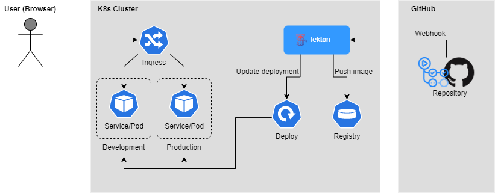

# Proposal: Implementation of Continuous Deployment (CD) Pipeline

Last updated: 08.12.2021 14:53

## Authors
- [Christian Aistleitner](https://github.com/christianaistleitner)
- [Marcel Brunnbauer](https://github.com/Marcel256)
- [Martin Zwifl](https://github.com/martin-zwifl)

## Abstract
This project is an assignment for the course 510.211 Special Topics - Cloud Computing (2021W), held at the Johannes Kepler University, Linz.
It aims for gaining additional hands-on experience and therefore, we concentrate on implementing our own CD pipeline. 

## Scope
Our goal is to implement a CD pipeline for a simple demo web app.
Therefore, we use the tool [Tekton](https://tekton.dev/) allowing us to build, test, and deploy.
For reasons of closeness to reality, we use a two-stage environment (i.e. development and production).
The aim is to demonstrate the possibilities of CD with cloud technology.

## Key Concepts
Tekton is an open-source cloud-native Continuous Integration and Deployment solution running on Kubernetes clusters. It can be separated into the following components:

Building blocks of a workflow:
- [Pipelines](https://tekton.dev/docs/pipelines) execute tasks with themself contain one or multiple steps
- [Triggers](https://tekton.dev/docs/triggers) instantiate pipelines runs and ensure the right timing within workflows

Workflow management:
- [Command-Line-Interface](https://tekton.dev/docs/cli) for workflow management
- [Dashboard](https://tekton.dev/docs/dashboard) in case you prefer a graphical interface

Workflow repository:
- [Catalog](https://tekton.dev/docs/catalog) is a repository containing predefined building blocks
- [Hub](https://hub.tekton.dev/) is a web app used for accessing the Tekton Catalog

Kubernetes integration:
- [Operator](https://tekton.dev/docs/operator) is a Kubernetes extension that allows us to manage Tekton components

## Architecture Diagram

## Milestones
- Proposal pulication (Deadline: 08.12.2021)
- Proposal refinement and acception (Deadline: 15.12.2021)
- Cluster and Tekton setup done
- Simple demo app + unit test implemented
- Delivery pipeline working
- Documentation finalized
- Final Presentation on 19.01.2022

## Responsibilities

### [Christian Aistleitner](https://github.com/christianaistleitner)
- Cluster/Tekton setup
- Tekton Dashboard

### [Marcel Brunnbauer](https://github.com/Marcel256)
- Trigger Bindings
- Demo app + unit test

### [Martin Zwifl](https://github.com/martin-zwifl)
- Task definition
- Pipeline config
