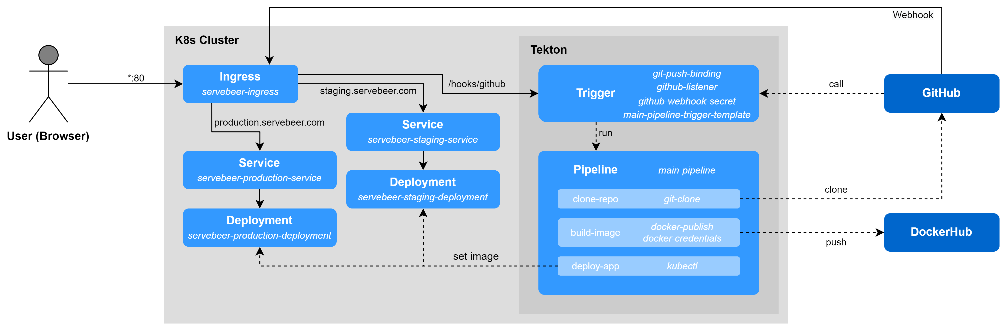

# Cloud Computing Project - Team 4

Last updated: 18.01.2021 17:00

Lecture: _Special Topics: Cloud Computing Architectures, Processes and Operations (510.211)_ <br>
University: _Johannes Kepler University Linz_

Project Idea: _Implementation of a Continuous Deployment (CD) Pipeline using Tekton_
(see [PROPOSAL.md](PROPOSAL.md))

## Authors
- [Christian Aistleitner](https://github.com/christianaistleitner)
- [Marcel Brunnbauer](https://github.com/Marcel256)
- [Martin Zwifl](https://github.com/martin-zwifl)

## Research

Tekton is an open-source cloud-native Continuous Integration and Deployment solution running on Kubernetes clusters. It can be separated into the following components:

Building blocks of a workflow:
- [Pipelines](https://tekton.dev/docs/pipelines) execute tasks which themself contain one or multiple steps
- [Triggers](https://tekton.dev/docs/triggers) instantiate pipelines runs and ensure the right timing within workflows

Workflow management:
- [Command-Line-Interface](https://tekton.dev/docs/cli) for workflow management
- [Dashboard](https://tekton.dev/docs/dashboard) in case you prefer a graphical interface

Workflow repository:
- [Catalog](https://tekton.dev/docs/catalog) is a repository containing predefined building blocks
- [Hub](https://hub.tekton.dev/) is a web app used for accessing the Tekton Catalog

Kubernetes integration:
- [Operator](https://tekton.dev/docs/operator) is a Kubernetes extension that allows us to manage Tekton components

## Overview



## Tutorial

### Step 0: Prerequisites

A Kubernetes cluster - we used [minikube](https://minikube.sigs.k8s.io/) on a VPS running Ubuntu 21.04.

### Step 1: Install

To install Tekton, follow the installation guide on https://tekton.dev/docs/getting-started#installation.

Note that the Tekton Dashboard and Tekton Triggers are NOT installed by default. <br>
To install it, follow the instructions on https://tekton.dev/docs/dashboard/#installation and https://tekton.dev/docs/triggers/install/.

For debugging purposes, the Tekton CLI tool might be really useful. To install it, follow the instructions on https://tekton.dev/docs/cli/#installation.

### Step 2: Deployment

All yaml files shown in this section need to be applied on the cluster.
This can be done by either executing

```console
kubectl apply -f <filename>
```

for every single file **or** in case you cloned this git repositroy, by executing

```console
kubectl apply ./files/deployment
```

which will apply all of those files at once.

**Deployments**

In order to deploy the sample web application (https://github.com/Marcel256/cloud-computing-demo), the following deployment yaml files need to be created.

For simplicity reasons, the docker image will be overwritten on every build, i.e. we reuse `latest` and `stable` tags on very image build.
In order to ignore the cached version on the kubernetes node, we specify `imagePullPolicy: Always` to allways pull the image from DockerHub.

```
apiVersion: apps/v1
kind: Deployment
metadata:
  name: servebeer-staging-deployment
spec:
  replicas: 1
  selector:
    matchLabels:
      app: servebeer-staging
  template:
    metadata:
      labels:
        app: servebeer-staging
    spec:
      containers:
      - name: server
        image: crix128/servebeer:latest
        imagePullPolicy: Always
        ports:
        - containerPort: 8080
```

The above one was for the staging envirnonment, the next one will be for the production envirnonment.

```
apiVersion: apps/v1
kind: Deployment
metadata:
  name: servebeer-production-deployment
spec:
  replicas: 1
  selector:
    matchLabels:
      app: servebeer-production
  template:
    metadata:
      labels:
        app: servebeer-production
    spec:
      containers:
      - name: server
        image: crix128/servebeer:stable
        imagePullPolicy: Always
        ports:
        - containerPort: 8080
```

**Services**

In oder to be able to connect the deployments and ingress, the following services need to be configured. <br>
A service is an abstraction layer and basically maps a cluster internal IP to the set of pods deployed earlier.

Note: A Service can map any incoming `port` to a `targetPort`. By default and for convenience, the `targetPort` is set to the same value as the `port` field.

```
apiVersion: v1
kind: Service
metadata:
  name: servebeer-staging-service
spec:
  ports:
  - port: 8080
  selector:
    app: servebeer-staging
  type: ClusterIP
```


```
apiVersion: v1
kind: Service
metadata:
  name: servebeer-production-service
spec:
  ports:
  - port: 8080
  selector:
    app: servebeer-production
  type: ClusterIP
```

**Ingress**

Finally, Ingress needs to be configured.
It will forward incoming HTTP requests to its associated service.

For example, any request with the header ```HOST staging.servebeer.com``` set will be forwarded to our `servebeer-staging-service` service.

The third ingress rule handles webhooks sent by GitHub. It checks whether its path equals `/hooks/github` and forwards the request to a special service created by Tekton. More on that later in *Step 4: Trigger*.

```
apiVersion: networking.k8s.io/v1
kind: Ingress
metadata:
  name: servebeer-ingress
spec:
  rules:
  - host: staging.servebeer.com
    http:
      paths:
      - path: /
        pathType: Prefix
        backend:
          service:
            name: servebeer-staging-service
            port:
              number: 8080
  - host: production.servebeer.com
    http:
      paths:
      - path: /
        pathType: Prefix
        backend:
          service:
            name: servebeer-production-service
            port:
              number: 8080
  - http:
      paths:
        - path: /hooks/github
          pathType: Exact
          backend:
            service:
              name: el-github-listener
              port:
                number: 8080
```

### Step 3: Pipeline

**Task**

The task kubectl is used for executing kubectl commands. It is used for deployment and uses only one parameter ```args``` specifying the command to be issued.

kubectl.yaml
```
apiVersion: tekton.dev/v1beta1
kind: Task
metadata:
  name: kubectl
spec:
  description: This Task can be used to run any kubectl command.
  params:
  - name: args
    description: The kubectl arguments as in 'kubectl <args>'.
  steps:
  - name: kubectl
    image: bitnami/kubectl:latest
    script: kubectl $(params.args)
```

The docker-credentials.yml needs to be EDITED in order to work properly. Insert your own username and token before applying.

docker-credentials.yml
```
apiVersion: v1
kind: Secret
metadata:
  name: docker-credentials
  annotations:
    tekton.dev/docker-0: https://hub.docker.com
type: kubernetes.io/basic-auth
stringData:
  username: <username>
  password: <token>
```


The docker-publish task got installed via Tekton Hub (```docker-build```) but didn't work in our case so was modified to the code beneath. It receives only the parameter ```image``` from the pipeline while others use the specified default. The sidecar is used to host a docker service as it needs to live among all steps.

docker-publish.yaml
```
apiVersion: tekton.dev/v1beta1
kind: Task
metadata:
  name: docker-publish
spec:
  description: This task will build and push an image using Docker.
  params:
  - name: image
    description: Name of the image Docker will produce.
  - name: dockerfile
    description: Path to the Dockerfile to build.
    default: ./Dockerfile
  - name: context
    description: Path to the directory to use as context.
    default: .
  - name: docker-credentials-secret
    description: Secret name containing username and password for login on Docker Hub.
    default: docker-credentials
  workspaces:
  - name: source
  results:
  - name: IMAGE_DIGEST
    description: Digest of the image just built.
  steps:
  - name: docker-build
    image: docker
    env:
    # Connect to the sidecar over TCP, with TLS.
    - name: DOCKER_HOST
      value: tcp://localhost:2376
    # Verify TLS.
    - name: DOCKER_TLS_VERIFY
      value: '1'
    # Use the certs generated by the sidecar daemon.
    - name: DOCKER_CERT_PATH
      value: /certs/client
    workingDir: $(workspaces.source.path)
    script: sleep 900; docker build --no-cache -f $(params.dockerfile) -t $(params.image) $(params.context)
    volumeMounts:
      - mountPath: /certs/client
        name: dind-certs
  - name: docker-push
    image: docker
    env:
    - name: USERNAME
      valueFrom:
        secretKeyRef:
          name: $(params.docker-credentials-secret)
          key: username
    - name: PASSWORD
      valueFrom:
        secretKeyRef:
          name: $(params.docker-credentials-secret)
          key: password
    # Connect to the sidecar over TCP, with TLS.
    - name: DOCKER_HOST
      value: tcp://localhost:2376
    # Verify TLS.
    - name: DOCKER_TLS_VERIFY
      value: '1'
    # Use the certs generated by the sidecar daemon.
    - name: DOCKER_CERT_PATH
      value: /certs/client
    workingDir: $(workspaces.source.path)
    script: |
      docker login -u $USERNAME -p $PASSWORD
      docker push $(params.image)
    volumeMounts:
      - mountPath: /certs/client
        name: dind-certs
  sidecars:
  - image: docker:dind
    name: docker-server
    securityContext:
      privileged: true
    env:
    # Write generated certs to the path shared with the client.
    - name: DOCKER_TLS_CERTDIR
      value: /certs
    volumeMounts:
    - mountPath: /certs/client
      name: dind-certs
    # Wait for the dind daemon to generate the certs it will share with the client.
    readinessProbe:
      periodSeconds: 1
      exec:
        command: ['ls', '/certs/client/ca.pem']
  volumes:
  - name: dind-certs
    emptyDir: {}
```

**Pipeline**

The main-pipeline.yaml is the single-one pipeline used for this sample project and therefore defines the flow of the tasks ```clone-repo```, ```build-image``` and ```deploy-app```. When called, it receives the parameters ```git-url```, ```git-revision```, ```deployment-name```, ```container-name``` and ```image-name```. Those are needed in order to access the right repository, refer to the advised image name and deploy the right application.

The task ```clone-repo``` (ref:```git-clone```) is publicly available and can be installed by executing the following command:

```console
kubectl apply -f https://raw.githubusercontent.com/tektoncd/catalog/main/task/git-clone/0.5/git-clone.yaml
```

The following code is also available in the repository at ./files/main-pipeline.yaml
```
apiVersion: tekton.dev/v1beta1
kind: Pipeline
metadata:
  name: main-pipeline
spec:
  params:
    - name: git-url
      type: string
    - name: git-revision
      type: string
    - name: deployment-name
      type: string
    - name: container-name
      type: string
    - name: image-name
      type: string
  workspaces:
    - name: source-code
  tasks:
    - name: clone-repo
      taskRef:
        name: git-clone
      params:
        - name: url
          value: $(params.git-url)
        - name: revision
          value: $(params.git-revision)
      workspaces:
        - name: output
          workspace: source-code
    - name: build-image
      taskRef:
        name: docker-publish
      params:
        - name: image
          value: $(params.image-name)
      workspaces:
        - name: source
          workspace: source-code
      runAfter:
        - clone-repo
    - name: deploy-app
      taskRef:
        name: kubectl
      params:
        - name: args
          value: set image deployment/$(params.deployment-name) $(params.container-name)=$(params.image-name)
      runAfter:
        - build-image
```
  
Applying all the yaml files referenced to the section taks and pipeline can be either done seperately or all in one by applying the whole directory, executing the following command:
```console
kubectl apply -f ./files/pipeline
```

### Step 4: Trigger

Github secret needs to be EDITED. Your own token needs to be inserted.

github-listener.yaml
```
apiVersion: v1
kind: Secret
metadata:
  name: github-webhook-secret
type: Opaque
stringData:
  token: <token>
```

**EventListener**

Webhook calles on-push our EventListener which triggers either the staging-trigger or the production-trigger depending on the branch that was pushed. To differentiate this we use a filter on the received body.

github-listener.yaml
```
apiVersion: triggers.tekton.dev/v1beta1
kind: EventListener
metadata:
  name: github-listener
spec:
  triggers:
    - name: staging-trigger
      interceptors:
        - ref:
            name: github
          params:
            - name: secretRef
              value:
                secretName: github-webhook-secret
                secretKey: token
            - name: "eventTypes"
              value: ["push"]
        - ref:
            name: cel
          params:
            - name: "filter"
              value: "body.ref == 'refs/heads/master'"
      bindings:
        - ref: git-push-binding
        - name: git-url
          value: https://github.com/Marcel256/cloud-computing-demo.git
        - name: deployment-name
          value: servebeer-staging-deployment
        - name: container-name
          value: server
        - name: image-name
          value: crix128/servebeer:latest
      template:
        ref: main-pipeline-trigger-template
    - name: production-trigger
      interceptors:
        - ref:
            name: github
          params:
            - name: secretRef
              value:
                secretName: github-webhook-secret
                secretKey: token
            - name: "eventTypes"
              value: ["push"]
        - ref:
            name: cel
          params:
            - name: "filter"
              value: "body.ref == 'refs/heads/stable'"
      bindings:
        - ref: git-push-binding
        - name: git-url
          value: https://github.com/Marcel256/cloud-computing-demo.git
        - name: deployment-name
          value: servebeer-production-deployment
        - name: container-name
          value: server
        - name: image-name
          value: crix128/servebeer:stable
      template:
        ref: main-pipeline-trigger-template
```

**TriggerBinding**

```
apiVersion: triggers.tekton.dev/v1alpha1
kind: TriggerBinding
metadata:
  name: git-push-binding
spec:
  params:
  - name: gitrevision
    value: $(body.ref)
```

**TriggerTemplate**

```
apiVersion: triggers.tekton.dev/v1beta1
kind: TriggerTemplate
metadata:
  name: main-pipeline-trigger-template
spec:
  params:
    - name: git-url
    - name: git-revision
    - name: deployment-name
    - name: container-name
    - name: image-name
  resourcetemplates:
    - apiVersion: tekton.dev/v1beta1
      kind: PipelineRun
      metadata:
        generateName: triggered-pipeline-run-
      spec:
        pipelineRef:
          name: main-pipeline
        params:
          - name: git-url
            value: $(tt.params.git-url)
          - name: git-revision
            value: $(tt.params.git-revision)
          - name: deployment-name
            value: $(tt.params.deployment-name)
          - name: container-name
            value: $(tt.params.container-name)
          - name: image-name
            value: $(tt.params.image-name)
        workspaces:
        - name: source-code
          volumeClaimTemplate:
            spec:
              accessModes:
                - ReadWriteOnce
              resources:
                requests:
                  storage: 1Gi
```

Applying all the yaml files referenced to the section trigger can be either done seperately or all in one by applying the whole directory:
```console
kubectl apply -f ./files/trigger
```

## Lessons-learned

- Item 1
- Item 2
- Item 3
